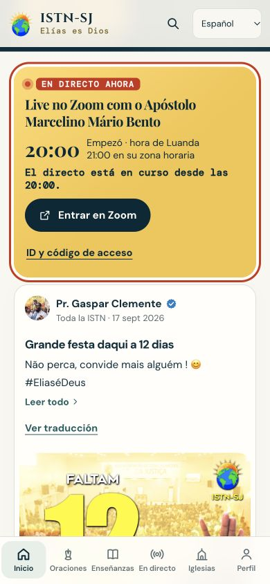

# Idiomas e tradução de publicações

Base: `origin/main` em `cadd5d9fc8f251a7c6daee705887a45f01a3c8a1` (inclui PR #39).
Branch: `codex/idiomas-pt-en-fr-es`.

## Comportamento

- Interface pública em português, inglês, francês e espanhol; seletor disponível antes de entrar na conta.
- Prioridade: escolha manual guardada neste dispositivo > idioma do perfil > primeiro idioma suportado da lista do navegador > português. Variantes como fr-CA, es-MX e pt-BR são reconhecidas. Alterações do idioma do dispositivo são acompanhadas apenas sem preferência manual/perfil.
- Nome bíblico: Elias / Elijah / Élie / Elías. Nome completo da igreja traduzido, mantendo a sigla ISTN-SJ. Nomes pessoais dos membros não são alterados.
- Publicações no início, anúncios e perfis têm “Ver tradução” / “Ver original”. A IA deteta o idioma original e traduz título e mensagem para o idioma atual da interface. Indicação de tradução automática e falhas recuperáveis; o original permanece disponível.
- Editar, partilhar, moderar, links, vídeos, autores, imagens e comentários continuam a usar os dados originais. Texto dentro de imagens e comentários não é traduzido nesta entrega.
- Navegação de Orações, comunidades, moderação e Zoom existentes no main preservados. Painel administrativo e traduções de áudio ao vivo não fazem parte desta entrega.

## Ativar tradução das publicações

1. Criar um recurso **Azure Translator**, do tipo serviço único, no plano **F0 (Free)**. O plano gratuito inclui 2 milhões de caracteres/mês, partilhados pelos pedidos do recurso. Não selecionar S1 para esta configuração gratuita.
2. Em **Keys and Endpoint**, obter a chave e a região. Guardar apenas no servidor/Render como `AZURE_TRANSLATOR_KEY` e `AZURE_TRANSLATOR_REGION` (por exemplo `westeurope`). Para um recurso Global, a região pode ficar vazia. Nunca colocar a chave no código, PR, navegador ou `/api/config`.
3. Integrar o PR e publicar a aplicação. Abrir um anúncio, mudar idioma, selecionar “Ver tradução”, verificar título/mensagem e voltar ao original.
4. Editar a mensagem original e repetir: a revisão anterior não deve reaparecer. Testar também sem ligação, quota atingida e troca de idioma durante um pedido.

Esta funcionalidade já não utiliza `OPENAI_API_KEY` nem `OPENAI_TRANSLATION_MODEL`. Apenas título/mensagem de publicações públicas carregadas pelo servidor são enviados ao Microsoft Translator. A língua de origem é detetada automaticamente, e português de saída usa `pt-pt`. As expressões conhecidas do nome da igreja, “Profeta Elias” e respetivas variantes são protegidas com traduções próprias; URLs e a sigla ISTN-SJ são preservados. Texto publicado é escapado antes da preparação HTML; o resultado volta a texto simples antes de chegar ao navegador.

Sem credencial, os quatro idiomas da interface continuam disponíveis e o botão informa que a tradução ainda não está disponível. O endpoint aceita POST da mesma origem, ID de publicação e um dos quatro idiomas; não aceita texto livre ou URLs do cliente. Recusa publicações indisponíveis/ocultas e dados marcados como antigos. A leitura pública mantém a cache existente de até um minuto.

As traduções são reutilizadas entre leitores por revisão e idioma por até 30 dias, até 500 entradas. A cache é guardada em `.cache/post-translations.json`, fora dos ficheiros públicos e do Git, e lida quando o servidor inicia. O caminho é configurável com `TRANSLATION_CACHE_FILE`. Falhas do disco deixam a cache em memória disponível. O sistema de ficheiros normal do Render é temporário: um deploy ou substituição da instância pode apagar esta cópia. Não é necessário contratar disco adicional; nesse caso as traduções serão geradas novamente quando pedidas. Para preservação entre deploys, usar um volume persistente já disponível, com um ficheiro por processo.

Pedidos simultâneos iguais partilham o trabalho. Limites locais por processo: 120 novos pedidos/hora, 30.000 caracteres/hora (contagem conservadora incluindo marcação) e 4 pedidos simultâneos. Contadores reiniciam com o processo e não são um orçamento mensal; é o plano F0 selecionado no Azure que define a quota gratuita. Múltiplas instâncias têm limites e ficheiros independentes. Não existe fallback para OpenAI nem mudança automática para um plano pago. Se o fornecedor recusar por quota/autorização, o original continua acessível.

## Verificação inicial da interface em 4 de outubro e integração Microsoft em 5 de outubro de 2026

- Testes automáticos completos e verificação de sintaxe (resultados finais registados no PR).
- Testes com fornecedor simulado: contrato da API, conteúdo público, revisão/cache, concorrência duplicada, limites, falhas/quota, alternância por idioma, XSS e preservação do original.
- Navegador: francês/inglês/espanhol com nomes e marca corretos; navegação de Orações do main presente. Espanhol em 390 × 844 sem deslocamento horizontal.
- Botão “Voir la traduction” e erro localizado verificados sem chave; original mantido.
- Endpoint real local: GET → 405; origem externa → 403; sem chave → 503 controlado.
- Integração Microsoft: 139 testes passaram, incluindo contrato HTTP, pt-pt, nomes protegidos, cache entre reinícios, limites por caracteres e concorrência. Credencial Azure ainda por configurar; traduções reais/qualidade não foram verificadas. Nenhuma migração ou publicação em produção realizada.

## Referências

- [Microsoft Translator — API Translate](https://learn.microsoft.com/en-us/azure/ai-services/translator/text-translation/reference/v3/translate)
- [Criar recurso Azure Translator](https://learn.microsoft.com/en-us/azure/ai-services/translator/how-to/create-translator-resource)
- [Preços e plano F0](https://azure.microsoft.com/en-us/pricing/details/translator/)

